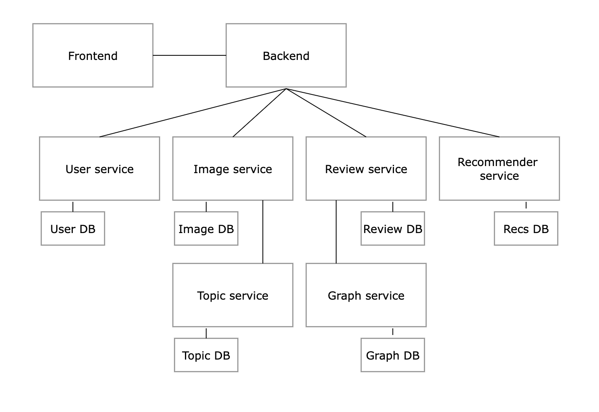

# hungry-ai

To run: `python src/frontend.py`

To test: `pytest tests`

## Components

- frontend: command line interface that sends queries to the backend
- backend: forwards requests from the frontend to the proper service
- user service: responsible for signing up / in / out
- image service: responsible for uploading / retrieving images
- review service: responsible for submitting reviews
- recommender service: responsible for getting recommendations
- topic service: gets a list of all topics
- graph service: responsible for computing edge weights and predicting ratings

